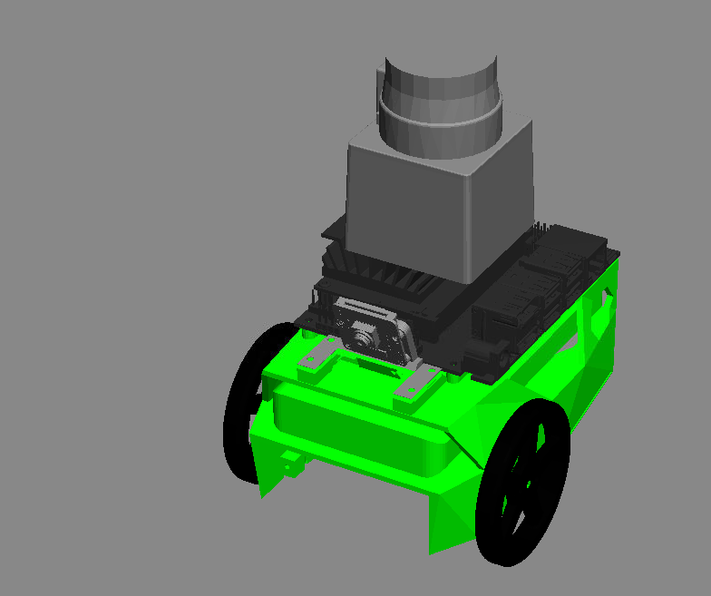

# RoboND-Jetbot-Where-Am-I
Project 2 of Udacity Robotics Software Engineer Nanodegree Program
[](https://youtu.be/imqXVSOmmfs)
  
## Overview  
In this project implement ROS AMCL package to accurately localize a Jetbot inside a map in the Gazebo simulation environments.

## Prerequisites/Dependencies  
* Gazebo >= 7.0  
* ROS Kinetic  
* ROS navigation package  

```
sudo apt-get install ros-kinetic-navigation
```
* ROS map_server package  
```
sudo apt-get install ros-kinetic-map-server
```
* ROS move_base package  
```
sudo apt-get install ros-kinetic-move-base
```
* ROS amcl package  
```
sudo apt-get install ros-kinetic-amcl
```

* ROS gazebo package  
```
sudo apt-get install ros-kinetic-gazebo-ros-pkgs ros-kinetic-gazebo-ros-control  ros-kinetic-effort-controllers
```

## Run the project  
* Clone this repository
* Open the repository and make  
```
cd /home/catkin_ws/
catkin_make
```
* Launch my_robot in Gazebo to load both the world and plugins  
```
cd /home/workspace/catkin_ws/
source devel/setup.bash
roslaunch my_robot world.launch
```  

* Launch AMCL package  
```
cd /home/workspace/catkin_ws/
source devel/setup.bash
roslaunch my_robot amcl.launch
```  

* Launch ROS Teleop Twist Keyboard which Jetbot model must keep speed at 0.1
```
cd /home/workspace/catkin_ws/
source devel/setup.bash
rosrun teleop_twist_keyboard teleop_twist_keyboard.py _speed:=0.1 _turn:=0.8
```  

* Launch ball_chaser and process_image nodes  
```
cd /home/workspace/catkin_ws/
source devel/setup.bash
roslaunch ball_chaser ball_chaser.launch
```  

