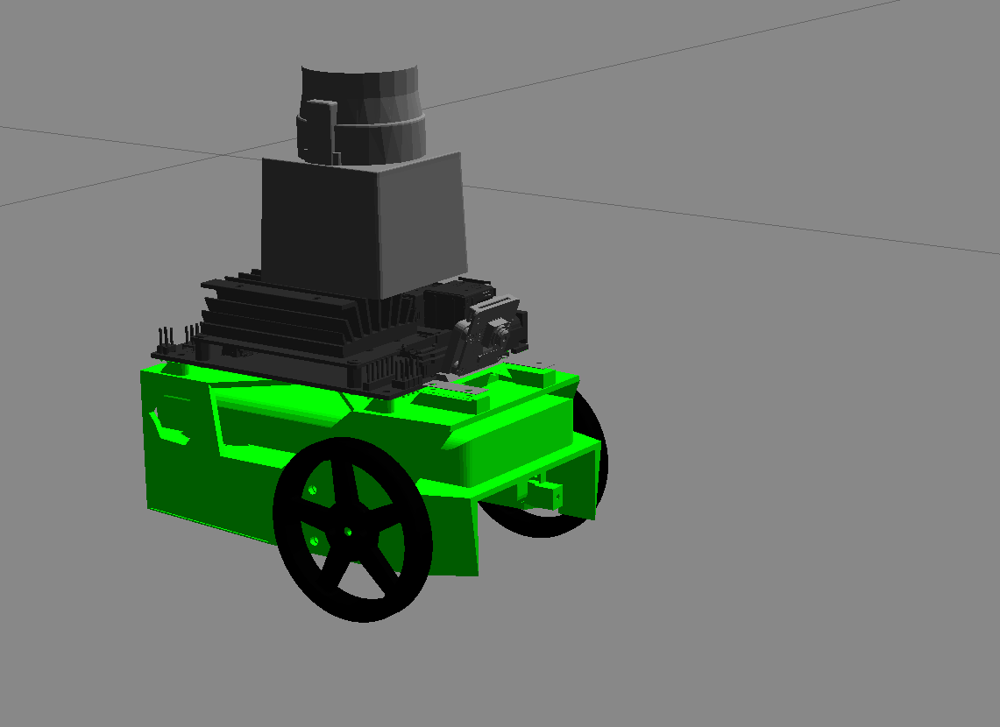

# Jetbot-ROS-Go-Chase-It
Project 2 of Udacity Robotics Software Engineer Nanodegree Program

  
  
  
## Overview  
This project contains two ROS packages inside `catkin_ws/src`: the `my_robot` and the `ball_chaser`. The Jetbot will be programmed to chase the white-colored ball inside the custom house. 

